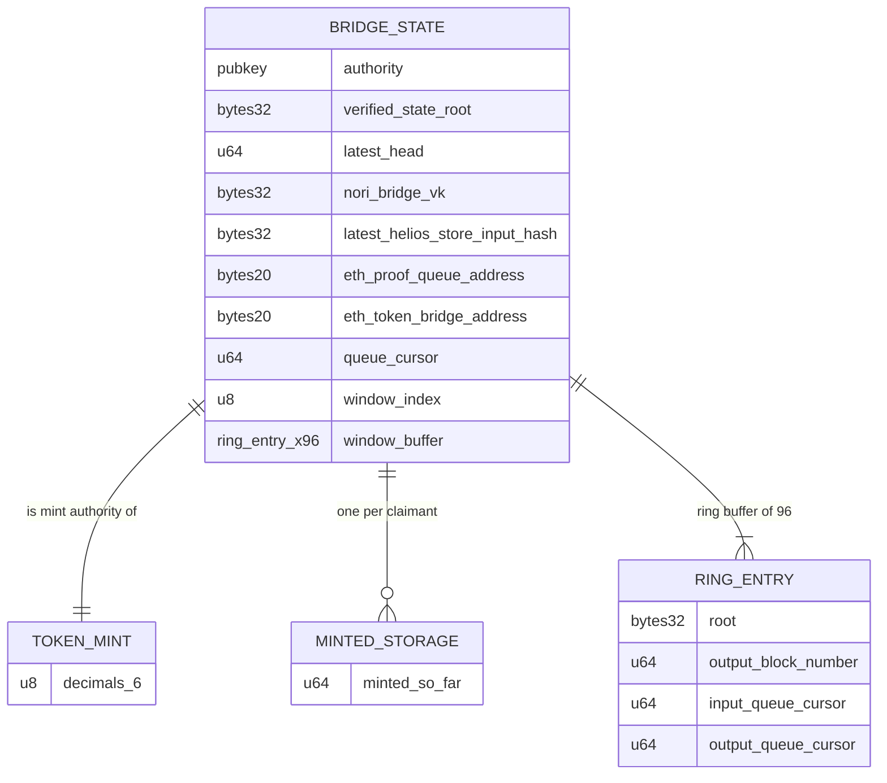

# nori-solana-sdk

Solana program for the Nori Ethereum→Solana token bridge. It accepts SP1
Groth16 proofs of Ethereum state — produced by
[nori-bridge-head](https://github.com/Nori-zk/nori-bridge-head), a Helios
light client — and mints SPL tokens against proven ETH deposits.

Proof verification is done on-chain by
[sp1-solana](https://github.com/Nori-zk/sp1-solana) using the BN254
syscalls.

## How it works



1. Users lock tokens in the ETH bridge contract. Deposit keys are
   `sha256(Ed25519 signature)` (SCRAM commitments) — the signature itself is
   not revealed on Ethereum.
2. nori-bridge-head proves Ethereum consensus and execution state and folds
   the pending deposit requests into a Merkle root. The proof's public
   values are a Borsh `ProofOutputs`: slots, state root, store hash, queue
   cursors, deposit-request root.
3. `update` — permissionless — verifies the Groth16 proof against the vkey
   hash stored at `initialize`, enforces continuity (queue cursor, head
   slot, store-hash chain, forward progress), advances the bridge state,
   and appends the deposit root to a 96-entry ring buffer.
4. `mint` — the claimant proves their deposit is in a recorded root (Merkle
   witness), opens the SCRAM commitment by revealing the signature (checked
   against the native ed25519 precompile instruction in the same
   transaction), and receives `locked_so_far - minted_so_far` tokens.

## Accounts

| Account | Seeds | Contents | Created in |
|---|---|---|---|
| Bridge state | `[b"STATE"]` | head, roots, cursors, vkey hash, ring buffer — 5 569 bytes | `initialize` |
| Token mint | `[b"NETH"]` | SPL mint; mint & freeze authority = state PDA | `initialize` |
| Minted-so-far | `[b"STORAGE", recipient]` | one `u64` per recipient — 16 bytes | `mint`, first claim per recipient |

## Security model

- Accepted proofs are those for the vkey hash pinned at `initialize`
  (`nori_bridge_vk`); the signer of `update` is irrelevant.
- Continuity checks in `update` reject replay, skip, and fork: a proof must
  resume exactly at the stored cursor/head/store-hash and advance them.
- Only the program can mint: the mint authority is the state PDA, whose
  signature exists only inside `mint` after the deposit checks.
- Per-recipient `minted_so_far` storage makes minting delta-based
  (`locked_so_far - minted_so_far`), so reusing a claim yields zero.

## Build & test

```bash
anchor build                                  # .so for the token program
anchor program deploy target/deploy/token.so  # cluster from Anchor.toml (localnet)
cargo test -p token                           # LiteSVM tests; loads target/deploy/token.so
cargo doc --open                              # API docs from rustdoc
```

Setup: [DEVELOPMENT_GUIDE.md](DEVELOPMENT_GUIDE.md).

Known build issue: the SBF build currently fails because alloy 1.8 crates
(pulled in via helios 0.11.0) require rustc ≥ 1.90 while the SBF toolchain
has 1.89. Expected fix is downgrading alloy versions in Cargo.lock
(`cargo update <name> --precise <older>`); not done yet.

## Open items

- `mint` does not yet check the witness root against the ring buffer, so
  deposit membership is not verified. Waiting on a real proof to test
  against.
- SCRAM binds the ETH-side signer's ed25519 key to the Solana recipient
  key; this coupling is under review and may be redesigned.
- Ring buffer has no expiry beyond overwrite after 96 updates.
