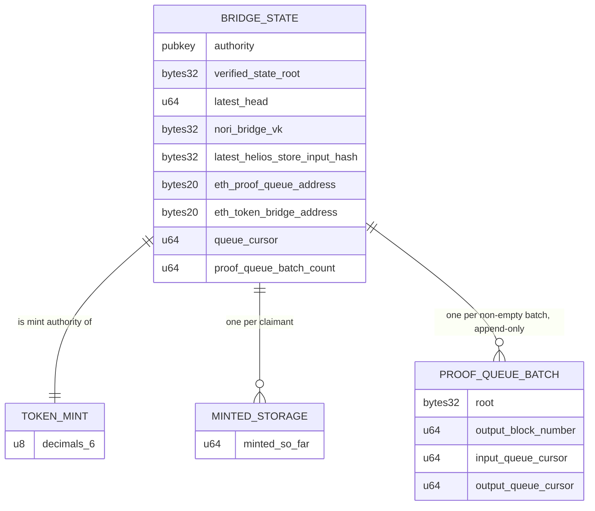

# nori-solana-sdk

Solana program for the Nori Ethereum→Solana token bridge. It accepts SP1
Groth16 proofs of Ethereum state — produced by
[nori-bridge-head](https://github.com/Nori-zk/nori-bridge-head), a Helios
light client — and mints SPL tokens against proven ETH deposits.

Proof verification is done on-chain by
[sp1-solana](https://github.com/Nori-zk/sp1-solana) using the BN254
syscalls.

## How it works



1. Users lock tokens in the ETH bridge contract. Deposit keys are
   `sha256(recipient_pubkey)` commitments — the Solana recipient is not
   revealed on Ethereum.
2. nori-bridge-head proves Ethereum consensus and execution state and folds
   the pending deposit requests into a Merkle root. The proof's public
   values are a Borsh `ProofOutputs`: slots, state root, store hash, queue
   cursors, deposit-request root.
3. `update` — permissionless — verifies the Groth16 proof against the vkey
   hash stored at `initialize`, enforces continuity (queue cursor, head
   slot, store-hash chain, forward progress) and advances the bridge state.
   When the proof's batch drained at least one request, it also records the
   batch's root and cursor range in a new proof queue batch account at the
   next index (`proof_queue_batch_count`). Batches are append-only, so a
   processed request stays provable forever. An update with an empty batch
   only advances the head.
4. `mint` — the claimant passes the proof queue batch that settled their
   deposit and a Merkle witness that must resolve to that batch's root,
   with the leaf index inside the batch's cursor range, and signs with the
   recipient key; the program checks `sha256(recipient)` against the
   committed deposit key and mints `locked_so_far - minted_so_far` tokens.
   Clients find the batch for a request id by searching indices
   `0..proof_queue_batch_count`: cursor ranges increase monotonically, and
   the leaf index is `request_id - input_queue_cursor`.

## Accounts

| Account | Seeds | Contents | Created in |
|---|---|---|---|
| Bridge state | `[b"STATE"]` | head, roots, cursors, vkey hash, proof queue batch count — 200 bytes, zero-copy | `initialize` |
| Token mint | `[b"NETH"]` | SPL mint; mint & freeze authority = state PDA | `initialize` |
| Proof queue batch | `[b"PROOF_QUEUE_BATCH", index.to_le_bytes()]` | batch root, output block number, input/output queue cursor — 64 bytes | `update`, once per non-empty batch |
| Minted-so-far | `[b"STORAGE", recipient]` | one `u64` per recipient — 16 bytes | `mint`, first claim per recipient |

## Security model

- Accepted proofs are those for the vkey hash pinned at `initialize`
  (`nori_bridge_vk`); the signer of `update` only pays rent for the proof
  queue batch account.
- Continuity checks in `update` reject replay, skip, and fork: a proof must
  resume exactly at the stored cursor/head/store-hash and advance them.
  Concurrent updates are serialized on the writable state account, so only
  one can claim a given proof queue batch index.
- `update` derives the next proof queue batch PDA from state and rejects
  any other account. Batch and minted-so-far PDAs are created through one
  path that tolerates the predictable address having been pre-funded
  (top-up, allocate, assign), so sending lamports to it cannot block
  creation.
- `mint` only accepts a proof queue batch account owned by the program with
  the batch discriminator — only `update` creates those — and requires the
  witness root to equal its root and the index to fall inside its range.
  `mint` reads the state account without write-locking it.
- Only the program can mint: the mint authority is the state PDA, whose
  signature exists only inside `mint` after the deposit checks.
- Per-recipient `minted_so_far` storage makes minting delta-based
  (`locked_so_far - minted_so_far`), so reusing a claim yields zero.

## Build & test

```bash
# .so for the token program (CFLAGS points ring's C build at the
# platform-tools freestanding headers)
CFLAGS="-isystem $HOME/.cache/solana/v1.54/platform-tools/llvm/sbpf/include" \
    cargo build-sbf --manifest-path programs/token/Cargo.toml

cargo test          # surfpool-backed suites; boots a validator per test
cargo doc --open    # API docs from rustdoc
```

Tests require `surfpool` and the `solana` CLI on PATH, and the `.so` built
first. Setup: [DEVELOPMENT_GUIDE.md](DEVELOPMENT_GUIDE.md).

The SBF toolchain ships rustc 1.89, so the alloy tree is pinned to 1.6.3
(MSRV 1.88) in Cargo.lock — the 1.7+ lines require 1.91. Transitive
`getrandom` 0.2 is forced onto its `custom` backend in
`programs/token/Cargo.toml`.

## Crates

| Crate | Contents |
|---|---|
| `programs/token` | The on-chain program: `initialize`, `update`, `mint` |
| `proof-submitter` | Client crate: loads SP1 proof JSONs, submits `update` txs over RPC (`SolanaProofSubmitter`), surfpool e2e suite |
| `cli` | `nori-cli` operator binary: `initialize` for an already deployed program (`cargo run -p nori-cli -- initialize --help`) |
| `test-utils` | Surfpool test harness shared by the suites and downstream crates: validator with kill-on-drop, funded keypairs, CLI deploy, custom error codes |
| `nori-hash-utils` | Workspace crate compiled to WebAssembly: nori-hash's request leaf and Merkle witness hashing for the TS SDK |

## npm packages

| Package | Folder | Contents |
|---|---|---|
| `@nori-zk/ethereum-solana-bridge` | `ethereum/` | Ethereum contracts, generated ethers types, and the `./iso-provider` Ethereum provider |
| `@nori-zk/nori-hash-utils` | `nori-hash-utils/` | The WebAssembly build of `nori-hash-utils` |
| `@nori-zk/nori-bridge-solana-sdk` | `sdk/` | The TS SDK: proof request state machines, batch search, witnesses |

Published together with `npm run publish` (`nw-publish`) from the repo root.
