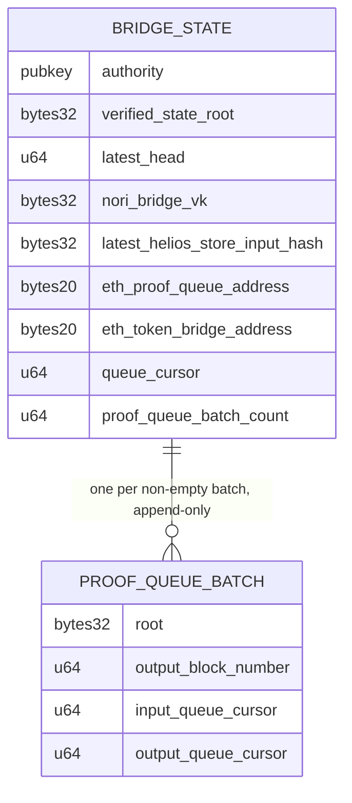
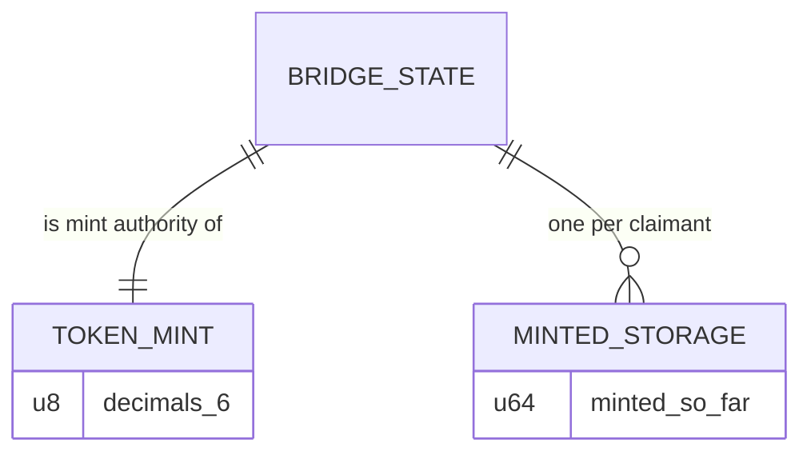

# nori-solana-sdk

Generic Ethereum→Solana state bridge. Any Ethereum contract can enqueue a
storage-proof request for one of its own storage slots on the proof request
queue. [nori-bridge-head](https://github.com/Nori-zk/nori-bridge-head), a
Helios light client running in SP1, proves Ethereum consensus and execution
state and folds each batch of drained requests into a Merkle root. The
Solana program verifies those SP1 Groth16 proofs on-chain with
[sp1-solana](https://github.com/Nori-zk/sp1-solana) (BN254 syscalls) and
commits every batch root, so any settled request can be proven on Solana by
Merkle witness.

Built on the queue, the token bridge locks ETH on Ethereum and mints the
matching SPL tokens on Solana.

## Packages

### `ethereum/` — npm `@nori-zk/ethereum-solana-bridge`

Ethereum contracts, Hardhat tasks and generated ethers types, plus the
`./iso-provider` Ethereum provider.

- [NoriProofRequestQueue.sol](ethereum/contracts/NoriProofRequestQueue.sol):
  append-only queue of storage-proof requests, drained in order by the SP1
  program. `target` is always `msg.sender`; each request pays
  `proofRequestQueueFee`.
- [NoriTokenBridge.sol](ethereum/contracts/NoriTokenBridge.sol): locks ETH
  and enqueues a proof request for each deposit.
- [TimeLockController.sol](ethereum/contracts/TimeLockController.sol):
  OpenZeppelin TimelockController used as the operator of both contracts,
  fronted by a Safe multisig.
- [tasks/](ethereum/tasks/): deploy, deployTimelock, lockTokens, fee admin
  and previews.

### `programs/token` — Solana program

- [lib.rs](programs/token/src/lib.rs): instructions `initialize`, `update`,
  `mint`.
- [instructions/initialize.rs](programs/token/src/instructions/initialize.rs):
  creates the bridge state and token mint, pinning the vkey hash and the
  Ethereum queue and bridge addresses.
- [instructions/update.rs](programs/token/src/instructions/update.rs):
  verifies a proof, advances the bridge state and commits the batch root.
- [instructions/mint.rs](programs/token/src/instructions/mint.rs): mints
  against a deposit proven by witness against a committed batch.
- [state.rs](programs/token/src/state.rs): zero-copy bridge state and proof
  queue batch accounts.
- [request_leaf_hash.rs](programs/token/src/request_leaf_hash.rs) and
  [deposit_witness.rs](programs/token/src/deposit_witness.rs): request leaf
  hashing and Merkle witness verification.
- [pda.rs](programs/token/src/pda.rs): program-owned PDA creation that
  tolerates pre-funded addresses.
- [tests/](programs/token/tests/): surfpool suites for `initialize`,
  `update` and `mint`.

### `idl/` and `sdk/src/program/` — generated

[idl/token.json](idl/token.json) and [idl/token.ts](idl/token.ts) are built
from `programs/token` by `anchor idl build`; the typed client in
[sdk/src/program/](sdk/src/program/) is rendered from the IDL by Codama
([sdk/scripts/generate-client.mjs](sdk/scripts/generate-client.mjs)). Both
are regenerated by `npm run build`.

### `sdk/` — npm `@nori-zk/nori-bridge-solana-sdk`

TypeScript SDK, built as YState machines: connections that keep working
offline-first (the user's Ethereum wallet, a public Solana RPC, and a check
for being online), following one proof request until its batch is
committed, a submitting address's requests as a paged history or a live
view, and Merkle witnesses checked against the committed batch root. See
[sdk/README.md](sdk/README.md).

### `nori-hash-utils/` — npm `@nori-zk/ethereum-solana-proof-queue-utils-glam`

nori-bridge-head's `nori-hash` compiled to WebAssembly with `wasm-bindgen` +
`tsify`: request leaf hashing, batch roots and Merkle witnesses for the TS
SDK. Built and published on its own with
[build.sh](nori-hash-utils/build.sh); see
[nori-hash-utils/README.md](nori-hash-utils/README.md).

### `proof-submitter/` — Rust client

- [proof_file.rs](proof-submitter/src/proof_file.rs): loads SP1 proof JSONs
  into the on-chain wire format.
- [submitter.rs](proof-submitter/src/submitter.rs): `SolanaProofSubmitter`,
  which builds and sends `update` transactions over RPC.
- [example-proofs/](proof-submitter/example-proofs/): four chained SP1
  Groth16 proofs used by the test suites.

### `cli/` — `nori-cli`

[main.rs](cli/src/main.rs): operator binary; `initialize` for an already
deployed program (`cargo run -p nori-cli -- initialize --help`).

### `test-utils/`

[lib.rs](test-utils/src/lib.rs): surfpool harness shared by the suites —
validator with kill-on-drop, funded keypairs, CLI deploy, custom error
codes.

## Install & build

Toolchain setup (Solana CLI, Anchor 1.1.2, Surfpool, Node):
[DEVELOPMENT_GUIDE.md](DEVELOPMENT_GUIDE.md).

From the repo root:

```bash
npm run reinstall     # clean node_modules, drop package-lock.json, npm install
npm run reinstall:ci  # clean node_modules, npm ci against package-lock.json
npm run build         # build:program, build:idl, build:js
```

`npm install` runs `install:sbf-tools` as its `preinstall`. The individual
steps:

```bash
npm run install:sbf-tools  # cargo build-sbf platform tools v1.54
npm run build:program      # target/deploy/token.so
npm run build:idl          # idl/token.json + idl/token.ts (--locked)
npm run build:js           # ethereum/, then sdk/ (its prebuild regenerates sdk/src/program/)
```

`build:program` passes the platform-tools freestanding headers in `CFLAGS`
for ring's C build.

## Test

```bash
npm test         # ethereum/ Hardhat suites and sdk/ Jest suites
cargo test       # surfpool suites; boots a validator per test
cargo doc --open # API docs from rustdoc
```

`cargo test` requires `surfpool` and the `solana` CLI on PATH and
`target/deploy/token.so` from `npm run build:program`.

The SBF toolchain ships rustc 1.89, so the alloy tree is pinned to 1.6.3
(MSRV 1.88) in Cargo.lock — the 1.7+ lines require 1.91. Transitive
`getrandom` 0.2 is forced onto its `custom` backend in
`programs/token/Cargo.toml`.

## Publish

```bash
npm run publish  # nw-publish: ethereum/ and sdk/ together
```

`@nori-zk/ethereum-solana-proof-queue-utils-glam` is published from
`nori-hash-utils/pkg/` after `nori-hash-utils/build.sh`.

## Proof queue



1. A contract calls `requestProof` on `NoriProofRequestQueue.sol` with a
   storage slot key of its own. Requests get sequential ids and are drained
   in order.
2. nori-bridge-head proves Ethereum consensus and execution state, reads the
   pending requests from the queue by Merkle-Patricia proof, and folds them
   into a batch root. The proof's public values are a Borsh
   `ProofOutputs`: slots, state root, store hash, queue cursors, batch root.
3. `update` — permissionless — verifies the Groth16 proof against the vkey
   hash stored at `initialize`, enforces continuity (queue cursor, head
   slot, store-hash chain, forward progress) and advances the bridge state.
   When the proof's batch drained at least one request, it also records the
   batch's root and cursor range in a new proof queue batch account at the
   next index (`proof_queue_batch_count`). Batches are append-only, so a
   processed request stays provable forever. An update with an empty batch
   only advances the head.
4. A client finds the batch for a request id by searching indices
   `0..proof_queue_batch_count` — cursor ranges increase monotonically —
   and builds a Merkle witness at leaf index `request_id -
   input_queue_cursor` that resolves to the batch's root.

| Account | Seeds | Contents | Created in |
|---|---|---|---|
| Bridge state | `[b"STATE"]` | head, roots, cursors, vkey hash, proof queue batch count — 200 bytes, zero-copy | `initialize` |
| Proof queue batch | `[b"PROOF_QUEUE_BATCH", index.to_le_bytes()]` | batch root, output block number, input/output queue cursor — 64 bytes | `update`, once per non-empty batch |

Security:

- Accepted proofs are those for the vkey hash pinned at `initialize`
  (`nori_bridge_vk`); the signer of `update` only pays rent for the proof
  queue batch account.
- Continuity checks in `update` reject replay, skip, and fork: a proof must
  resume exactly at the stored cursor/head/store-hash and advance them.
  Concurrent updates are serialized on the writable state account, so only
  one can claim a given proof queue batch index.
- `update` derives the next proof queue batch PDA from state and rejects
  any other account. PDAs are created through one path that tolerates the
  predictable address having been pre-funded (top-up, allocate, assign), so
  sending lamports to it cannot block creation.

## Token mint



1. A user locks ETH in `NoriTokenBridge.sol`, which enqueues a proof
   request for the deposit. Deposit keys are `sha256(recipient_pubkey)`
   commitments, so the Solana recipient stays private on Ethereum.
2. Once `update` commits the batch that settled the deposit, the recipient
   calls `mint` with that proof queue batch and a Merkle witness that must
   resolve to the batch's root, with the leaf index inside the batch's
   cursor range, signing with the recipient key.
3. The program checks `sha256(recipient)` against the committed deposit key
   and mints `locked_so_far - minted_so_far` tokens.

| Account | Seeds | Contents | Created in |
|---|---|---|---|
| Token mint | `[b"NETH"]` | SPL mint; mint & freeze authority = state PDA | `initialize` |
| Minted-so-far | `[b"STORAGE", recipient]` | one `u64` per recipient — 16 bytes | `mint`, first claim per recipient |

Security:

- `mint` only accepts a proof queue batch account owned by the program with
  the batch discriminator — only `update` creates those — and requires the
  witness root to equal its root and the index to fall inside its range.
  `mint` reads the state account without write-locking it.
- Only the program can mint: the mint authority is the state PDA, whose
  signature exists only inside `mint` after the deposit checks.
- Per-recipient `minted_so_far` storage makes minting delta-based
  (`locked_so_far - minted_so_far`), so reusing a claim yields zero.
